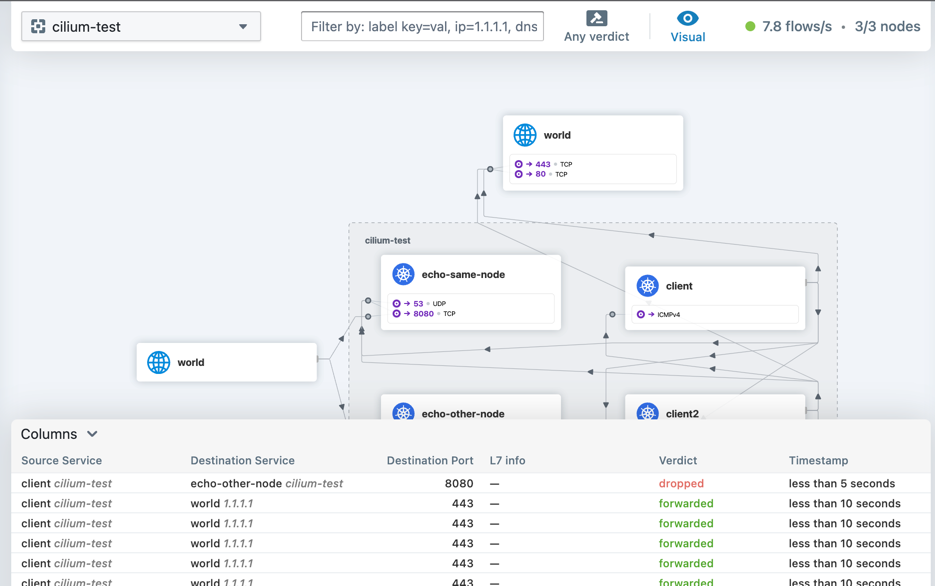

# kind-cilium

Setup k8s [Kind](https://kind.sigs.k8s.io/) cluster with [Cilium CNI](https://docs.cilium.io/) with 
[StartWars](https://docs.cilium.io/en/stable/gettingstarted/demo/) demo workloads.

* Nodes: 1 master, 2 workers (ubuntu 22.04)
* Kubernetes v1.26.2
* Workloads from **Cilium [StartWars](https://docs.cilium.io/en/stable/gettingstarted/demo/)** demo
* Observability: [Hubble + UI](https://docs.cilium.io/en/v1.13/gettingstarted/hubble/) (optional)


### Pre-requisites

 * **MacOS** (Intel or Apple Silicon)
 * **[Docker](https://docs.docker.com/desktop/)**
 * **[Helm](https://helm.sh/docs/intro/install/)**

### Installation

To provision the cluster run (it also installs kubectl, Kind and Cilium Cli, if missing):

```shell
bin/istall.sh --hubble
```

Verify the cluster:

```shell
kubectl get nodes -o wide

NAME                   STATUS   ROLES           AGE     VERSION   INTERNAL-IP   EXTERNAL-IP   OS-IMAGE             KERNEL-VERSION     CONTAINER-RUNTIME
cilium-control-plane   Ready    control-plane   2m35s   v1.26.2   172.19.0.4    <none>        Ubuntu 22.04.2 LTS   5.15.49-linuxkit   containerd://1.6.18
cilium-worker          Ready    worker          2m17s   v1.26.2   172.19.0.2    <none>        Ubuntu 22.04.2 LTS   5.15.49-linuxkit   containerd://1.6.18
cilium-worker2         Ready    worker          2m17s   v1.26.2   172.19.0.3    <none>        Ubuntu 22.04.2 LTS   5.15.49-linuxkit   containerd://1.6.18
```

#### Observability

To get to the Hubble UI run:
```shell
cilium hubble ui
ℹ️ Opening "http://localhost:12000" in your browser...
```
Generate some network traffic with Cilium tests:
```shell
cilium connectivity test
```
Select `cilium-test` namespace in the Hubble Dashboard (<http://localhost:12000/cilium-test>):



### Clean-up

```shell
kind delete cluster --name cilium
```

### Troubleshooting

* [Kind](https://kind.sigs.k8s.io/docs/user/known-issues/#troubleshooting-kind)
* [Cilium](https://docs.cilium.io/en/v1.13/operations/troubleshooting/)
